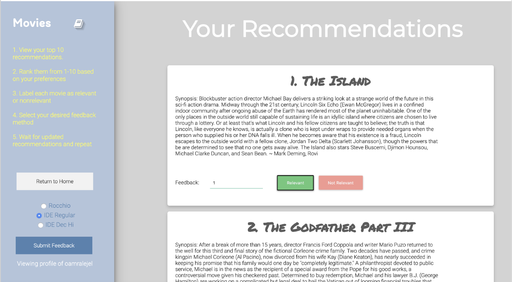

# A Social Media Based Recommendation System
### Vinny Ahluwalia, Shaeq Ahmed, Joshua Israel, Anthony Liang, Harry Wang  (Team 4)

## Dependencies

Run this command to install the dependencies needed for this project

`pip3 install -r requirements.txt`

Download pickles files from Google Drive

Link:

## How to run:

(Steps 1 and 2 are necessary to run scraper)
1. Install `chromedriver` from https://sites.google.com/a/chromium.org/chromedriver/
2. Move chromedriver to root directory of project
3. Load the webapp: `python3 app.py`. This will load the flask app on localhost. Navigate
to the path specified in the terminal.
4. You have reached the home page. Type in username and password to your Facebook.
5. Fill in relative or absolute path to Facebook and Twitter (optional) profile. `e.g. /shaeqahmed`.
6. Hit the Generate Recommendation button. You should see a Chrome window pop up and automate the Facebook scraping.
7. Generating recommendations usually takes ~45seconds - a minute. It should redirect to another route once the recommendations are generated.
8. Follow the instructions on the side panel of the page to submit feedback and update your recommendations.





## Repo Tree
```
├── PorterStemmer.py
├── README.md
├── app.py
├── chromedriver
├── collaborative_filtering.py
├── dataset_parse.py
├── evaluation_graphs.py
├── inverted_index.py
├── preprocess.py
├── relevanceFeedback.py
├── scraper.py
├── static
│   ├── animate.min.css
│   ├── formstyle.css
│   ├── home_style.css
│   ├── images
│   │   └── avengers.jpg
│   └── rec_style.css
├── templates
│   ├── homepage.html
│   └── recommendations.html
└── utils
    ├── __init__.py
    ├── auth.py
    ├── story.py
```